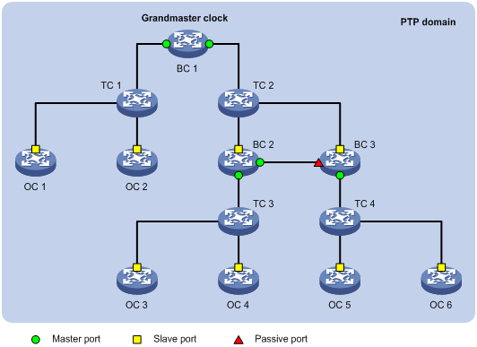
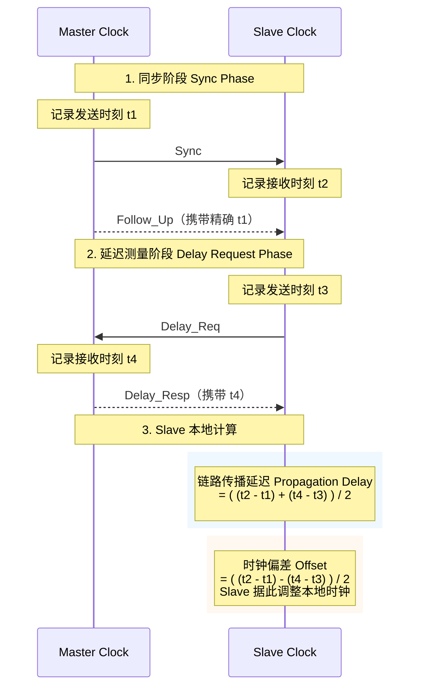

# PTP
Precision Time Protocol 精确时间协议是一种时间同步协议，用于设备之间的高精度时间同步。

## 对比NTP、PTP
|  | NTP | PTP |
| --- | --- | --- |
| 精度 | 10 - 100ms | < 1us | 
| 实现方式 | 软件 | 需要网卡支持 |
| 源 | NTP源 | 一般为GPS GM |

## PTP基本概念
#### PTP域
应用了PTP协议的网络称为PTP域。PTP域里只有一个同步始终，其余所有设备与该时钟同步
#### 时钟节点
PTP域中的设备称为时钟节点，有以下3种分类：
1. Ordinary Clock OC普通时钟 只有一个PTP端口参与时间同步
2. Boundary Clock BC边界时钟 有多个PTP端口参与时间同步。其中一个端口从上游时钟节点同步时间，并通过其余端口向下游发布时间。
3. Transparent Clock TC透明时钟 有多个PTP端口，但不与其他时钟节点保持同步，只转发PTP协议报文并对转发时延矫正。TC包括两种类型：
  - End-to-End E2E端到端，只在报文的发送和接收端记录时间戳
  - Point-to-Point P2P点到点，只转发Sync、Follow_up、Announce报文而终结其他报文。并参与整条两路上每一段链路的延时

| | OC | BC | TC |
| --- | --- | --- | --- |
| 端口数 | 1个(Master或Slave) | 多个(一个Slave、多个Master) | 多个(透传) |
| 报文 | 生产或消费 | 终结后重新生成 | 只修正correctionFeild | 
| 误差 | 终端，不产生误差 | 每级引入少量误差10-50ns | 每级引入极少量误差1-5ns | 
| 典型设备 | 服务器、GM | 交换机 | 交换机 |

#### 最优时钟 GM
整个PTP域的参考时间就是最优时钟 Grandmaster Clock GM, 也是最高层次时钟。最优时钟可以通过手动静态配置，也可以通过Best Master Clock 最佳主时钟协议动态选举

#### PTP端口 
设备上运行了PTP协议的端口称为PTP端口，有以下3种分类：
1. Master Port 主端口 发布同步时间的端口，可能存在于BC或OC上
2. Slave Port 从端口 接收时间同步的端口，可能存在于BC或OC上
3. Passive Port 被动端口 不发送也不接收同步的端口，只存在于BC上

## PTP主从对时原理
